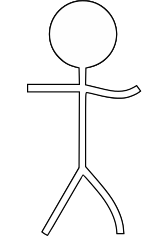

Por um fio
==========
Tente resolver quebra cabeças, estando preso ao seu colega.
Quanto mais perto, maior, e quanto mais longe, menor. Use isso e o elo que liga
você e seu amigo para resolver vários quebra cabeças nesse jogo de plataforma.

*Por um fio* é um jogo de puzzle plataforma feito na [LivreJam
2017](https://livregamejam.org/) usando a [Godot
engine](http://godotengine.org/) e está disponível gratuitamente na plataforma
[itch.io](https://fog-icmc.itch.io/por-um-fio).

Licensa
-------
Os códigos são distribuídos segundo a licensa
[LGPLv3](https://www.gnu.org/licenses/lgpl.html) e os assets gráficos (arquivos
.svg e .png) e sonoros (arquivos .ogg e .wav) segundo a licensa [CC BY
4.0](https://creativecommons.org/licenses/by/4.0/).

